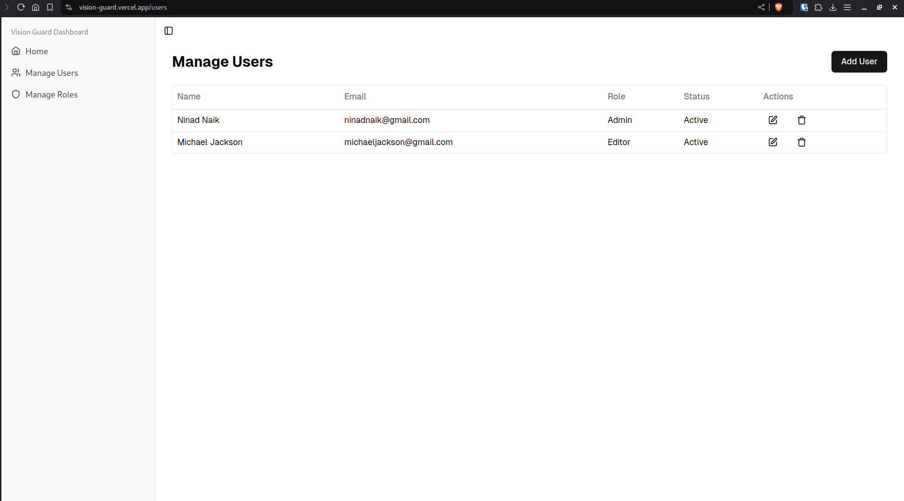
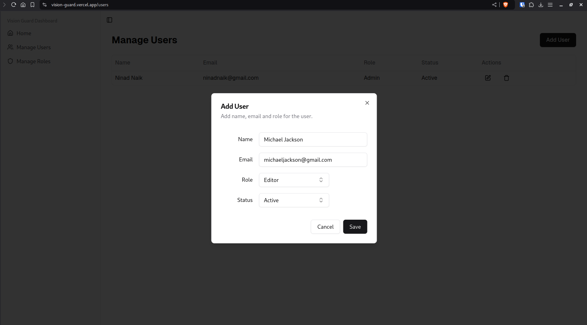
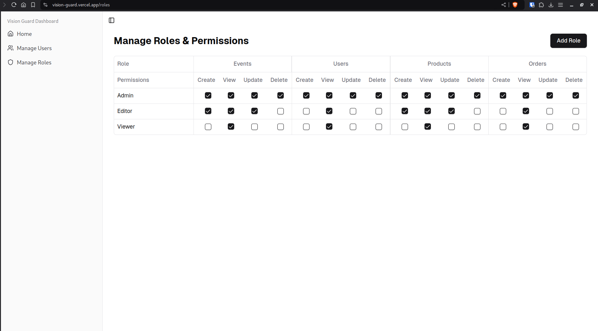
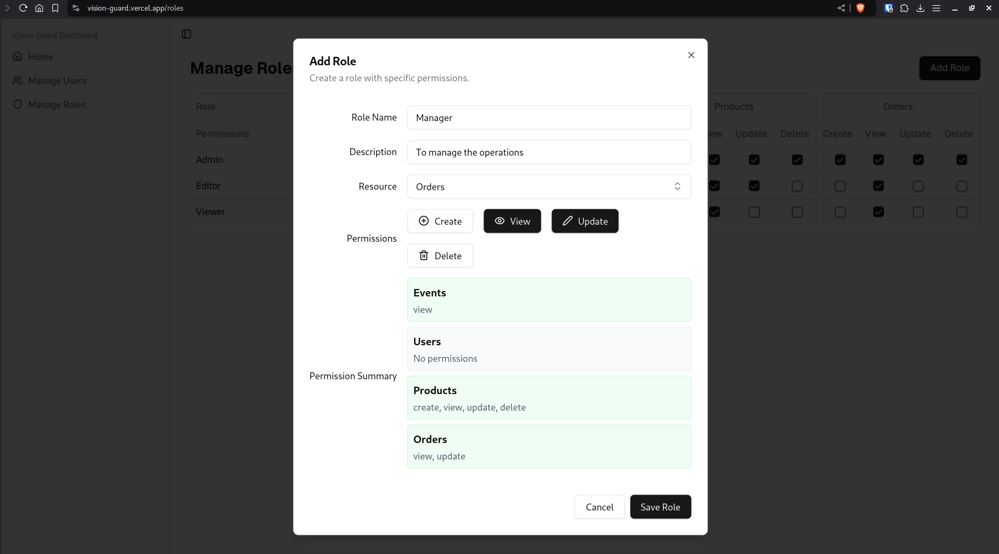
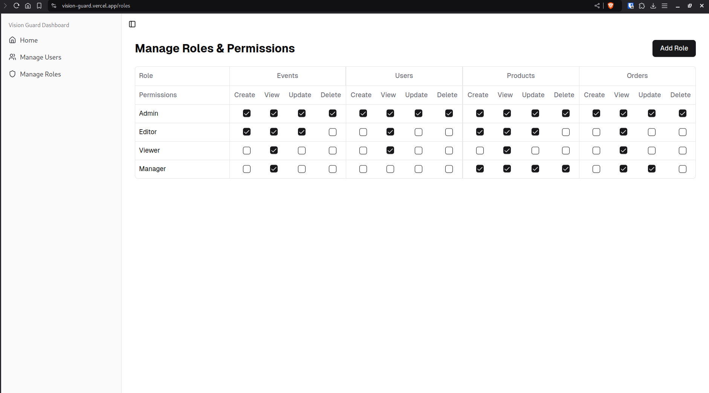

## Vision Guard - RBAC Admin Dashboard

This project is a Role-Based Access Control (RBAC) User Interface designed and developed for the VRV Security Frontend Developer Intern assignment. It provides a robust and user-friendly platform for managing users, roles, and permissions within an organization.

**Live Demo:** [https://vision-guard.vercel.app](https://vision-guard.vercel.app/)

### Features

- **User Management:**
  - View a list of all users with their assigned roles and status.
  - Add new users with customizable details.
  - Edit existing user information and assigned roles.
  - Delete users from the system.
  - Activate/Deactivate user accounts.
- **Role Management:**
  - Define and manage different roles within the organization (e.g., Admin, Editor, Viewer).
  - Assign specific permissions to each role.
  - Add new roles with custom names and descriptions.
  - Edit existing role definitions and permissions.
  - Delete roles that are no longer needed.
- **Dynamic Permissions:**
  - Granular control over permissions for each role.
  - Assign or revoke permissions for specific actions (e.g., Read, Write, Delete) on different resources.
  - Clear visual representation of permission assignments for each role.
- **Intuitive UI:**
  - Clean and modern interface built with Next.js and Shadcn UI for a seamless user experience.
  - Easy navigation and clear visual hierarchy for efficient management.
  - Responsive design to ensure optimal functionality across various devices.

### Technologies Used

- **Next.js:** A React framework for building performant and user-friendly web applications.
- **Shadcn UI:** A highly customizable and accessible component library for React.

* **Jotai:** A lightweight and flexible state management library for React.

### Installation and Setup

1. **Clone the repository:**

   ```bash
   git clone https://gitlab.com/ninadnaik07/vision-guard.git
   cd vision-guard
   ```

2. **Install dependencies:**

   ```bash
   npm install
   ```

3. **Run the development server:**

   ```bash
   npm run dev
   ```

4. **Access the application:**
   Open your browser and go to `http://localhost:3000` (or the port specified in your Next.js configuration).

### Project Structure

```
.
├── app
│   ├── favicon.ico
│   ├── fonts
│   │   ├── GeistMonoVF.woff
│   │   └── GeistVF.woff
│   ├── globals.css
│   ├── layout.tsx
│   ├── page.tsx
│   ├── roles
│   │   └── page.tsx
│   └── users
│       └── page.tsx
├── atoms
│   ├── RoleAtom.ts
│   └── UserAtom.ts
├── components
│   └── custom
│       ├── AddRoleDialog.tsx
│       ├── AddUserDialog.tsx
│       ├── AppSidebar.tsx
│       ├── ResourceSelectBox.tsx
│       ├── RolesPermissionTable.tsx
│       └── SelectBox.tsx
├── components.json
├── hooks
│   └── use-mobile.tsx
├── lib
│   └── utils.ts
├── next.config.ts
├── next-env.d.ts
├── package.json
├── postcss.config.mjs
├── README.md
├── tailwind.config.ts
├── tsconfig.json
├── types
│   └── types.ts
└── yarn.lock

11 directories, 28 files

```

### Security Considerations

- **Input Validation:** Implement input validation to prevent malicious data from being submitted.
- **Error Handling:** Handle potential errors gracefully to provide informative feedback to the user.

### Future Enhancements

- **Advanced Filtering and Search:** Allow users to filter and search for users and roles based on various criteria.
- **Audit Logs:** Track changes made to users, roles, and permissions for accountability and security monitoring.
- **Integration with Real APIs:** Connect the UI to a backend API for real-world functionality.
- **Role Hierarchy:** Implement a hierarchical role structure for more complex permission management.

This project demonstrates a solid foundation for an RBAC admin dashboard. With its user-friendly interface, robust features, and potential for future enhancements, it effectively addresses the requirements of the VRV Security Frontend Developer Intern assignment.

### Screenshots

#### User dashboard



#### Add User Dialog box



#### Roles Dashboard



#### Add Role Dialog box



#### New role added


